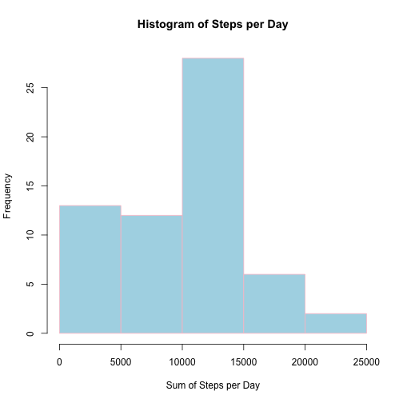
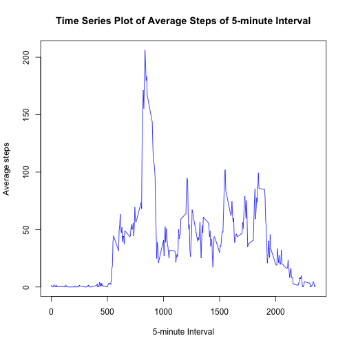
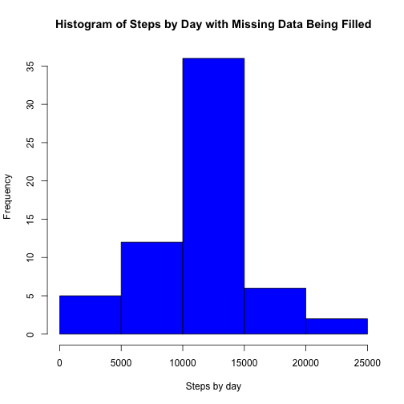
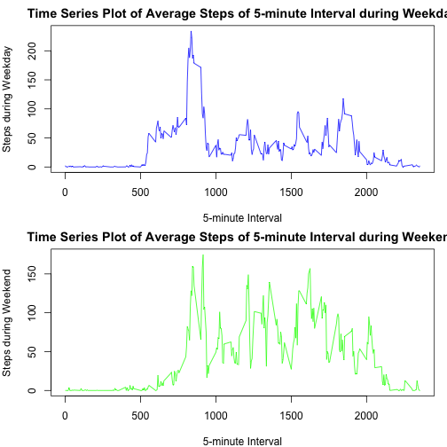

## Reproducible Research Peer-graded Assignment Course Project 1
## Project Introduction
This assignment makes use of data from a personal activity monitoring device. This device collect data at 5 minute intervals throughout the day. The data consists of two months of data from an anonymous individual collected during the months of October and November, 2012 and include the number of steps taken in 5 minute intervals each day.

### Data 
The data for this assignment can be downloaded from the course website.
Dataset: Activity monitoring data

The variables included in this dataset are:

step:Number of steps taking in a 5-minute interval
date:The date on which the measurement was taken in YYYY-MM-DD format
interval: Identifier for the 5-minute interval in which measurement was taken

The dataset is stored in a comma-separated-value(CSV)file and there are a total of 17,568 observations in this dataset.

### 1.Read and Processing the data


```r
activity<- read.csv("/Users/Nickychu/desktop/activity.csv", header=TRUE, sep=",")
activity$date<-as.Date(activity$date, format="%Y-%m-%d")
```

### 2.Plot the histogram of the total number of steps taken each day during the two months


```r
library(dplyr)
```

```
## 
## Attaching package: 'dplyr'
```

```
## The following objects are masked from 'package:stats':
## 
##     filter, lag
```

```
## The following objects are masked from 'package:base':
## 
##     intersect, setdiff, setequal, union
```

```r
steps_day<- tapply(activity$steps, activity$date, sum, na.rm=TRUE)
steps_day<- data.frame(steps_day)
hist(steps_day$steps_day, col = "lightblue", border = "pink", xlab="Sum of Steps per Day", main="Histogram of Steps per Day")
```



### 3.Mean and Median number of steps taken each day


```r
library(dplyr)
steps_day_mean<-mean(steps_day$steps_day)
steps_day_median<-median(steps_day$steps_day)
```
The mean steps taken each day is 9354.2295082 ;
The median steps taken each day is 10395.

### 4. Time series plot of the average number of steps taken 


```r
library(dplyr)
steps_ave_by5min<-tapply(activity$steps, activity$interval, mean, na.rm=TRUE)
plot(steps_ave_by5min ~ unique(activity$interval), type="l", col="blue", xlab="5-minute Interval", ylab="Average steps", main="Time Series Plot of Average Steps of 5-minute Interval")
```



### 5. The 5-minute Interval that, on average, contains teh maximum number of steps


```r
steps_max<- round(steps_ave_by5min[which.max(steps_ave_by5min)])
print(steps_max)
```

```
## 835 
## 206
```

### 6. Code to describe and show a strategy for imputing missing data


```r
table(is.na(activity$steps)==TRUE)
```

```
## 
## FALSE  TRUE 
## 15264  2304
```

```r
data_missing<-mean(is.na(activity$steps))
total_missing<-sum(is.na(activity$steps))
```
The total numbers of missing data in this dataset is 2304, and the proportion of missing data is 0.1311475.

### Filling in the missing data with the mean of the steps of 5-minute intervals


```r
activity1<- activity
for(i in 1:nrow(activity)){
      if(is.na(activity$steps[i])){
      activity1$steps[i]<-steps_ave_by5min[[as.character(activity[i,"interval"])]]
      }
}
```


### 7.Histogram of the total number of steps taken each day after missing values are imputed

```r
steps_td<-tapply(activity1$steps, activity1$date, sum)
hist(steps_td, col="blue", xlab="Steps by day", main="Histogram of Steps by Day with Missing Data Being Filled")
```



### 8. Panel plot comparing the average number of steps per 5-minute interval across weekdays and weekends


```r
activity1<-activity
activity1$weekday<-weekdays(activity$date)
activity1[which(activity1$weekday %in% c("Saturday","Sunday")),]$weekday<-"weekend"
activity1[which(activity1$weekday %in% c("Monday","Tuesday","Wednesday","Thursday","Friday")),]$weekday<-"weekday"
activity_weekend<- subset(activity1, activity1$weekday=="weekend")
activity_weekday<- subset(activity1, activity1$weekday=="weekday")
steps_5mins_weekend<- tapply(activity_weekend$steps, activity_weekend$interval, mean,na.rm=TRUE)
steps_5mins_weekday<- tapply(activity_weekday$steps, activity_weekday$interval, mean,na.rm=TRUE)
par(mfrow=c(2,1),mar=c(4,4,2,1))
plot(steps_5mins_weekday ~ unique(activity_weekday$interval), type="l", col="blue", xlab="5-minute Interval", ylab="Steps during Weekday", main="Time Series Plot of Average Steps of 5-minute Interval during Weekday")
plot(steps_5mins_weekend ~ unique(activity_weekend$interval), type="l", col="green", xlab="5-minute Interval", ylab="Steps during Weekend", main="Time Series Plot of Average Steps of 5-minute Interval during Weekend")
```


